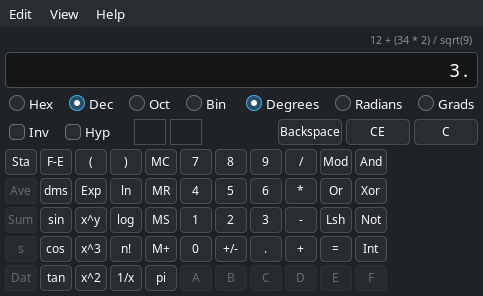

# xpcalc

A calculator with the Windows XP calculator's layout, written in Python with
**GTK 3** — the same toolkit Thunar/Xfce 4.20 uses, so it picks up your GTK 3
theme without any extra styling.



The line above the display keeps the whole task visible — operands, operators,
brackets and functions — until you press `=` or Enter, which clears it and
leaves the result.

## Requirements

* Python 3.8+
* PyGObject with GTK 3 (`python-gobject` + `gtk3` on Arch,
  `python3-gi gir1.2-gtk-3.0` on Debian/Ubuntu)

## Install

```sh
./install.sh              # into ~/.local
sudo ./install.sh         # into /usr/local
PREFIX=/opt ./install.sh  # anywhere else
./install.sh --uninstall  # remove it again
```

The script checks that PyGObject/GTK 3 is present, then installs:

| What | Where |
| --- | --- |
| the package | `$PREFIX/share/xpcalc/xpcalc/` |
| an `xpcalc` launcher | `$PREFIX/bin/xpcalc` |
| the desktop entry | `$PREFIX/share/applications/xpcalc.desktop` |
| icons, 16px to 256px + SVG | `$PREFIX/share/icons/hicolor/*/apps/xpcalc.*` |

It rewrites the entry's `Exec` lines to point at the installed launcher,
validates the entry with `desktop-file-validate` when that is available, and
refreshes the desktop and icon caches. `--uninstall` removes every one of those
files again.

To run without installing:

```sh
python3 -m xpcalc            # or --standard / --scientific
```

## Desktop integration

The `.desktop` entry is plain freedesktop.org, so it works the same in GNOME,
KDE, Xfce, Cinnamon, MATE and LXQt:

* categorised under `Utility;Calculator;`, with search keywords, so it shows up
  in every application menu and launcher
* its own icon installed into the **hicolor** theme at eight raster sizes plus
  a scalable SVG — no reliance on the current icon theme shipping a calculator
  icon
* `StartupWMClass=xpcalc` matches the window's `WM_CLASS` (`"xpcalc",
  "Xpcalc"`, set through `GLib.set_prgname`), so docks and taskbars group the
  window with its launcher instead of showing an unnamed extra entry — this is
  also the Wayland `app_id`
* **launcher actions**: right-clicking the icon in a dock or menu offers
  *Standard Mode* and *Scientific Mode*, which run `xpcalc --standard` and
  `xpcalc --scientific`
* `StartupNotify=true`, so the cursor shows the usual launch feedback

## What it does

**Standard mode** — the four operations, `sqrt`, `%`, `1/x`, `+/-`, memory
(`MC MR MS M+`), `Backspace`, `CE`, `C`. Strictly left to right, like XP.

**Scientific mode** — everything above plus:

| Group | Keys |
| --- | --- |
| Bases | `Hex` `Dec` `Oct` `Bin`, with `Qword`/`Dword`/`Word`/`Byte` word sizes |
| Angles | `Degrees` `Radians` `Grads` |
| Trigonometry | `sin` `cos` `tan`, with `Inv` for arc- and `Hyp` for hyperbolic |
| Logarithms | `ln` `log`, `Inv` gives `e^x` and `10^x` |
| Powers | `x^y` `x^2` `x^3` `n!` `1/x`, `Inv` gives the matching roots |
| Bitwise | `Mod` `And` `Or` `Xor` `Lsh` (`Inv` → right shift) `Not` `Int` |
| Statistics | `Sta` opens the data box, then `Dat` `Ave` `Sum` `s` |
| Display | `Exp` for exponent entry, `F-E` for scientific notation, `dms` |
| Expression | the running task, e.g. `12 + (34 * 2) / sqrt(9)`, above the result |
| Grouping | parentheses up to 25 deep, with full operator precedence |

`Inv` unticks itself after one use, as it does in XP. Number bases grey out the
digits and functions they cannot use, and `Not` uses two's complement at the
selected word size — `Not 1` in Dword hex is `FFFFFFFE`, which reads `-2` in
Dec.

### Expression line

The task you have entered stays on the small line above the display until `=`
or Enter, then clears:

| Pressed | Expression line | Display |
| --- | --- | --- |
| `12 + 34 *` | `12 + 34 *` | `34.` |
| `2 * ( 3 + 4 )` | `2 * (3 + 4)` | `7.` |
| `9` `sqrt` | `sqrt(9)` | `3.` |
| `( 2 + 3 )` `sqrt` | `sqrt(2 + 3)` | `2.2360679...` |
| `1` `Inv` `sin` | `asin(1)` | `90.` |
| `2 + 3 =` | *(empty)* | `5.` |
| then `*` | `5 *` | `5.` |

Functions show as soon as you press them, so a square root never disappears
into its result. Pressing `=` on a result and carrying on with an operator
continues from that result. `CE` leaves the expression alone; `C` clears it.

### Precision

Results carry **32 significant digits**, matching the XP calculator. Python's
`math` module only reaches 17, so `dmath.py` implements the transcendental
functions as `Decimal` series expansions:

```
sqrt(2)  1.4142135623730950488016887242097
ln(2)    0.69314718055994530941723212145818
pi       3.1415926535897932384626433832795
sin(30)  0.5
```

## Keyboard

| Key | Action | Key | Action |
| --- | --- | --- | --- |
| `0`–`9`, `A`–`F` | digits | `Esc` | `C` |
| `+ - * /` | operators | `Del` | `CE` |
| `Enter` or `=` | equals | `Backspace` | backspace |
| `(` `)` | parentheses | `%` | percent |
| `@` | square root | `!` | factorial |
| `r` | `1/x` | `y` | `x^y` |
| `n` / `l` | `ln` / `log` | `x` | `x^2` |
| `s` / `o` / `t` | sin / cos / tan | `i` / `h` | `Inv` / `Hyp` |
| `F5`–`F8` | Hex / Dec / Oct / Bin | `F2`–`F4` | angle unit, or word size |
| `Ctrl+C` / `Ctrl+V` | copy / paste the display | `F12` | Qword |

## Layout

`View` switches between Standard and Scientific and toggles digit grouping.
`View → XP button colours` adds XP's blue digits and red operators; it is off by
default so your GTK theme decides the colours.

Everything in the `View` menu is remembered between sessions in
`~/.config/xpcalc/settings.json` (or `$XDG_CONFIG_HOME/xpcalc/settings.json`):

```json
{
  "mode": "scientific",
  "digit_grouping": false,
  "xp_colours": false
}
```

The file is written atomically on every change. If it is missing, corrupt or
unwritable the defaults are used and the calculator starts normally.

## Tests

```sh
python3 -m unittest discover -s tests
```

## License

MIT - see [LICENSE](LICENSE).

## Files

| File | Purpose |
| --- | --- |
| `xpcalc/engine.py` | calculation state machine — UI independent |
| `xpcalc/dmath.py` | 32-digit transcendental functions on `Decimal` |
| `xpcalc/ui.py` | GTK 3 widgets and the XP layout |
| `xpcalc/settings.py` | remembers the View menu between sessions |
| `tests/` | engine and settings test suites |
| `data/xpcalc.desktop` | desktop entry with launcher actions |
| `data/xpcalc.svg`, `data/icons/` | application icon, SVG and 16-256px PNGs |
| `install.sh` | installer / uninstaller |
